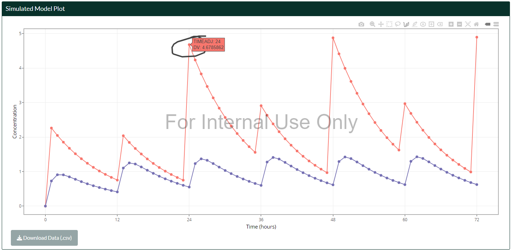
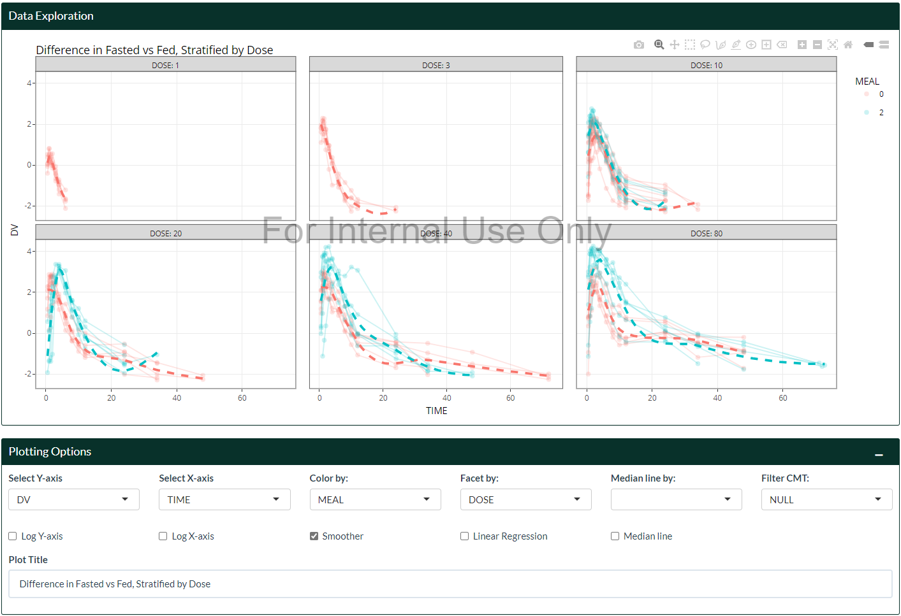
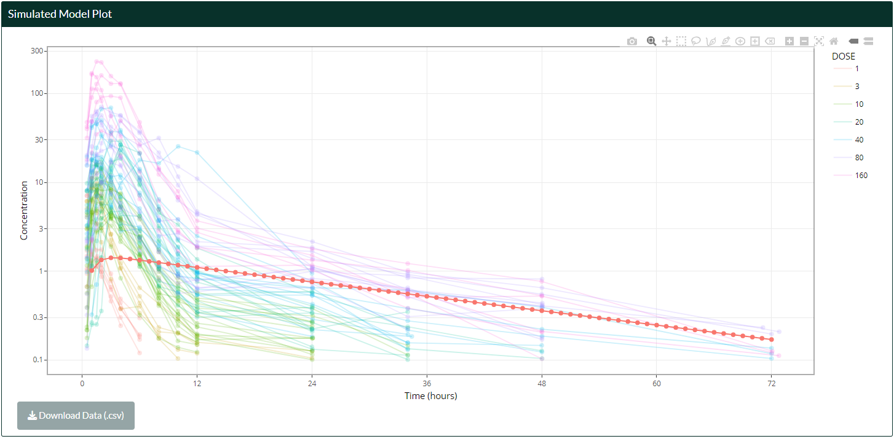
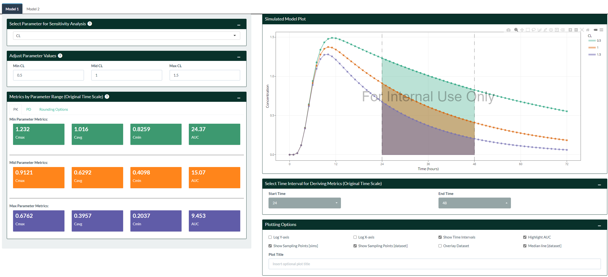
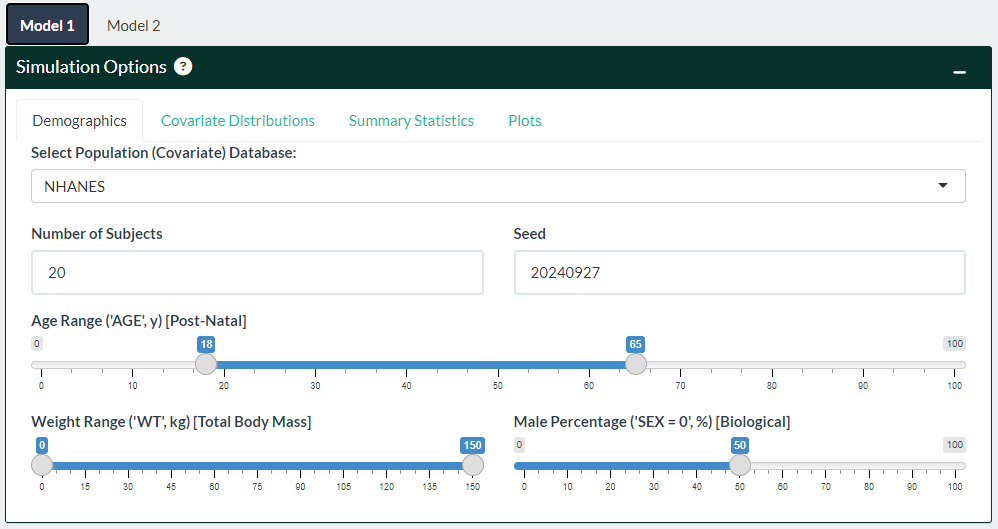
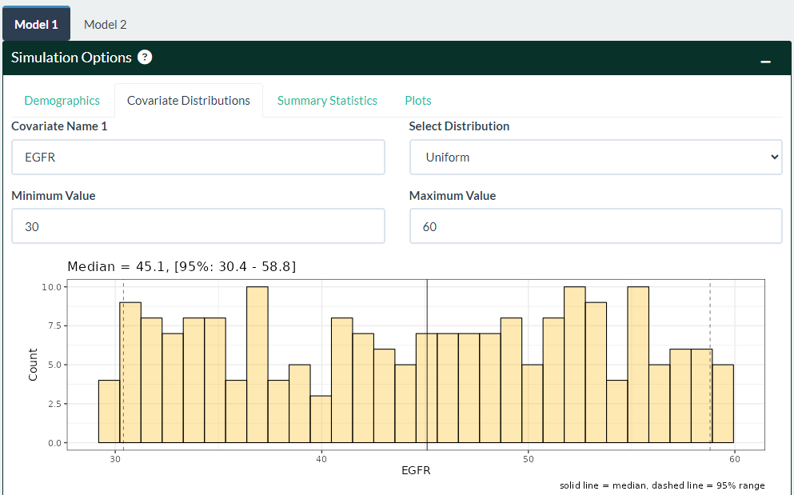
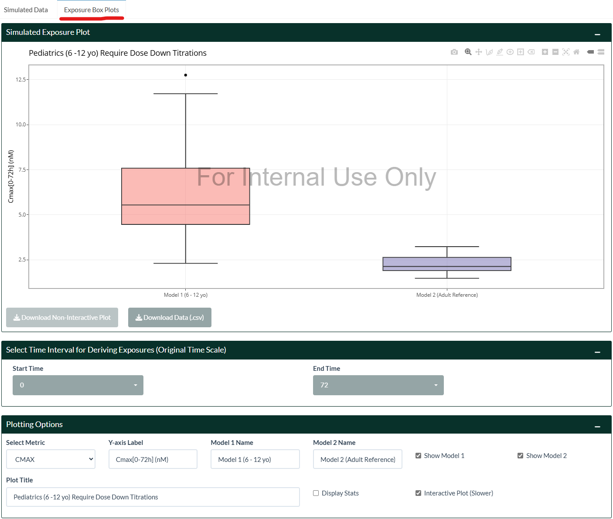

<!-- README.md is generated from README.Rmd. Please edit that file -->

# Model Visualization Platform

<!-- badges: start -->
<!-- badges: end -->

`MVPapp` is an R package that bundles the
<a href="https://mvp.boehringer-ingelheim.com/" target="_blank">Model
Visualization Platform (MVP)</a> Shiny application for local use and/or
deployment. MVP is an interactive pharmacometrics environment requiring
minimal setup from the users, and is developed with user-friendliness as
a top priority so even non-modelers may be able to explore different
aspects of the models without too much hassle, whilst balancing
complexity for advanced users. Some features include:  
- Live code editing using
<a href="https://github.com/metrumresearchgroup/mrgsolve"
target="_blank">mrgsolve</a>  
- Flexible dosing regimens, supporting up to 5 independent dosing
schedules per model  
- Basic data exploration and data cleaning, and overlaying of data  
- Quick NCA output and reporting  
- Model comparison to visualize differences  
- Parameter sensitivity analysis to easily evaluate impact of changing
parameters  
- Automatic PK/PD metrics using a user-defined time range  
- Variability assessment using external databases such as the
<a href="https://wwwn.cdc.gov/nchs/nhanes/Default.aspx"
target="_blank">NHANES</a>,
<a href="https://www.who.int/childgrowth/standards/weight_for_age/en/"
target="_blank">WHO</a>, and
<a href="https://www.cdc.gov/growthcharts/percentile_data_files.htm"
target="_blank">CDC</a> virtual patients  
- Custom covariate distributions to further assess variability

**The goal of MVP is to support initial model development and facilitate
internal discussions more efficiently.**

## Installation

`MVPapp` is not currently on CRAN. Install it via `devtools`:

``` r
## Install devtools first if required
# install.packages(devtools)

devtools::install_github("Boehringer-Ingelheim/MVPapp", build_vignettes = TRUE)
```

Once installed, launch MVP using the following commands:

``` r
library(MVPapp)

run_mvp()

## Alternatively, launch the app without watermarks
## see ?run_mvp for more options
# run_mvp(insert_watermarks = FALSE)
```

## Getting Started

### Simulations without Variability

This is the default landing page when the App is launched. It looks a
bit empty at the moment, however it is very simple to start generating a
model and show a plot. All important settings are neatly situated
together on the same page so the user can appreciate in real-time
whenever they change certain aspects of the model. This page should be
the **homepage** as other pages of the app inherit settings from this
page (e.g. dosing and axis choices).


1.  Navigate to the “Select Model 1” box on the left hand side and
    choose a template model from the drop-down list, or upload your own
    .cpp file.
    - Once a model is selected or uploaded, you can make further changes
      in the Code Editor below.  
    - You may also copy across your own model code by selecting the
      “Blank Template” model. Note that when you switch models, all
      changes are lost.
    - Note that the **entire model code is a string** that is assigned
      to the `model_code` object, and initialized as `model_object`.
      Therefore, if the model code contains quotation marks, the user
      will have to remove those manually (or escape them using the back
      slash, `\`) to avoid compilation errors.  
2.  Click on the `Generate Model 1` button. If the model compiles, the
    “Parameter Values” box will be populated, and a plot will show up on
    the right hand side.
    - If the model fails to compile, check the “Model Info (Console)”
      box for the error message.  
    - Note that **all sources of variability are ignored on this page**
      (`zero_re()` from `mrgsolve` is applied). Navigate to the
      Variability Page if you want to assess variability in populations
      (see section below).
3.  Dosing is handled on the right hand side above the plot. Each tab
    contains independent dosing schedules that will be combined
    together. The “Transform Dose” tab contains more options that are
    self-explanatory. The “Model Duration/Rate” tab provides options to
    handle modeling duration or rate, which are done automatically by
    default.
4.  Plotting options are on the right hand side below the plot. Most of
    the options are self-explanatory, and the ones that require
    clarification have a pop-up tooltip when you click on the input
    selection. Once a dataset has been uploaded from the “Data Input”
    page, it can be overlaid on top of the simulations (see section
    below).  
5.  Sampling times are configured on the right hand side below the plot
    in the “Simulation Options” tab. A custom sampling schedule can be
    defined (make sure to also check the “Use Custom Sampling Times”
    checkbox).
6.  A second Model can be generated by repeating steps 1-5 by navigating
    to the “Model 2” tab on the top left. The models are completely
    separate in every aspect, making visual comparisons in dosing
    regimens or model structures extremely easy.
    - By default, the dosing regimens for Model 2 is collapsed for
      appearance. Click on the “+” icon on the right hand side to expand
      it.



7.  In general, most plots are interactive (using the `plotly` package),
    which allows zooming, panning, drawing etc, controlled from the top
    right of the plot. The camera icon downloads the current plot, based
    on the options set by the “Download Options” box on the bottom right
    of the page.


### Uploading Datasets and Data Exploration

Uploading NONMEM-formatted datasets (.csv) and tab-delimited text files
(.txt) is supported in the “Data Input” page. Some default cleaning
options are applied automatically from the “Built-in Dataset Cleaning
Options” box. Further filtering and cleaning may be applied in the code
editor on the left hand side. The dataset should have the “ID”, “TIME”,
and “DV” columns to be fully supported by the rest of the app (e.g. data
overlay). At minimum, only the “ID” column is required to support Data
Exploration in the Data Input page. If missing, the user may create /
rename these columns using the code editor.

1.  The filtered dataset (i.e. after passing through the code editor) is
    shown on the right hand side table.  
2.  Summary statistics of the data per ID is shown on the second sub tab
    on the top right hand side.  
3.  Descriptive statistics (NCA) can be derived (supporting non-NONMEM
    datasets) by defining the options and then clicking the “Calculate
    NCA” button, from the “Descriptive Statistics” tab. Note that **this
    feature is experimental and assumes a single dose per subject only
    for a single compartment. The user may need to filter their dataset
    accordingly.** The displayed table can be transposed if required.
    Results and plots per subject can be downloaded by the buttons at
    the bottom of the page.


4.  Quick data exploration are provided by the “General Plot”, “Ind.
    Plot”, and “Corr. Plot” tabs (tip: clicking on the legend can toggle
    each subgroup on/off when the plot is interactive):

General plots are flexible plots that can handle continuous/continuous,
continuous/discrete (Box plot option), and discrete/discrete (Box plot
option) types of data. Settings from General Plots will be carried over
to the “Ind. Plot”, where users can explore individual profiles in more
detail. Dosing information (“EVID”, “ADDL”, “II”, “RATE” columns) can be
inserted on each plot when the Dose Column is provided. LLOQ information
can also be inserted.



Correlation plots are grouped by ID and are useful to explore potential
correlations between covariates.


**Note: once a dataset is uploaded, its display can be toggled on other
pages by checking the “Overlay Dataset” checkbox in the “Plotting
Options” in each respective page!**



### Parameter Sensitivity Analysis

After a model has been generated from the Simulation page, the impact of
perturbing parameter values can be assessed in the Parameter Sensitivity
Analysis. MVP makes this transition seamless by carrying across
previously defined model settings and making them available (i.e. in
`$PARAM`) for selection.

1.  Select a parameter of interest from the top left drop-down list.  
2.  Adjust parameter values immediately below. By default, MVP provides
    3 profiles (±50% of the original value, and the original value
    itself). The user may further adjust the values manually as they see
    fit.  
3.  Changes are immediately shown on the plot on the right, and PK/PD
    metrics are provided on the left page under each respective sub tab.
    - If you have a PK/PD model, you may need to switch the Y-axis from
      the Simulation page to display PD information, assuming your
      default Y-axis is PK concentration.  
    - The rounding of the metrics can be changed in the “Rounding
      Options” sub tab.  
4.  The time interval to derive metrics can be adjusted in the “Select
    Time Interval for Deriving Metrics” box, below the plot.
    - Note that **the original time scale is always used** (if the user
      has changed scaling by using the “Scale X-axis (Divide by)” option
      from the Simulation page).  
5.  Plotting and Download Options are similar to those in the Simulation
    page.  
6.  Simulations of the middle profile, in addition to its derived
    metrics can be downloaded in the Table page.



### Simulations with Variability

What makes MVP truly a joy to use is its ease in answering typical
questions such as:  
- What are the predicted PK exposures in pediatrics?  
- What are the predicted PK exposures within a certain weight range?  
- What are the predicted PK exposures in patients with moderate to
severe renal impairment (or any other covariate where having a
**distribution** is desired)?  
- What is the likelihood of maintaining PD response above a certain
threshold?  
- …or a *combination* of the above questions together!

All of these questions can be handled in MVP in seconds, massively
reducing turnaround time from team discussions (or even doing this
live)!

#### Defining Population (Covariates)

1.  External patient databases
    (<a href="https://wwwn.cdc.gov/nchs/nhanes/Default.aspx"
    target="_blank">NHANES</a>,
    <a href="https://www.cdc.gov/growthcharts/percentile_data_files.htm"
    target="_blank">CDC</a>, <a
    href="https://www.who.int/toolkits/child-growth-standards/standards/weight-for-age"
    target="_blank">WHO</a>) can be configured in the “Demographics” box
    on the top left. Select a relevant database from the drop-down list,
    or use “None” to only change the number of subjects being simulated.
    - If the model code contains any of `AGE`, `WT`, `HT`, `BMI`, or
      `BSA` in its `$PARAM` section, its value will be **replaced** by
      the subjects’ value from the sampled database.  
    - Sampled demographics can be downloaded in the “Summary Statistics”
      sub-tab if the user wants to use this to perform their own
      simulations.  
    - Histogram of weight and age can be viewed in the “Plots” sub-tab.



2.  Custom covariate distributions can be defined (e.g. `EGFR`) and
    inserted similarly together with the database shown in step 1). Up
    to 3 unique covariate distributions are enabled.
    - Normal, Log-normal, uniform, binary categorical distributions are
      supported.  
    - Once defined, they will be made available in the “Summary
      Statistics” sub tab and able to be downloaded.



#### Assessing Variability

Both OMEGAs and SIGMAs, if it exists in the model, will be available for
the user to adjust on the bottom left hand side of the page. Once ready,
click the “Update Model” button to generate new simulations.  
- There are built-in checks to ensure matrices are positive
semi-definite and non-negative, however the user should make sure that
values are sensible. The “Matrix Info” box below should match the
matrices - if not, that means the inputted matrices were invalid and the
matrices has reverted to its last known state.

1.  A plot with variability should appear on the right after “Update
    Model” has been pressed (note: any time the matrices are changed,
    the user needs to click the “Update Model” for it to take effect).  
2.  The display can be changed to either show percentile range or
    individual profiles in the “Plotting Options”.  
3.  Percentage of subjects above a certain value can be calculated in
    the “Threshold Calculations” box on the right.
    - By default, the last time is used. However this can be changed
      using the “At Time (Original Scale)” option.


#### Comparing Exposure Differences

Summary of exposure metrics are readily available to be viewed, which is
handy when assessing differences in models, dosing regimens, and/or
demographics. 

1.  Navigate to the “Exposure Box Plots” on the top right side of the
    page.  
2.  Select the time intervals of interest to derive metrics, which could
    be relevant when deriving AUCtau,ss, for example. By default the
    entire time range is used.
3.  Pick an exposure metric in the “Select Metric” option in the
    “Plotting Options” box. Currently, Cmax, Cmin, Cavg, AUC, Tmax and
    Tmin are supported.
4.  Labels, titles, and the option to insert more summary statistics are
    available to further customize the plot, allowing great
    “off-the-shelf” graphics to be downloaded for presentations.



## Extended Features and Vignettes

### Providing external models and changing default settings

Please see the article on [Supplying Passworded
Models](https://boehringer-ingelheim.github.io/MVPapp/articles/supply-passwords.html),
or access the vignette on this topic in R
(`vignette("supply-passwords", package = "MVPapp"`) for instructions on
how to provide external models on App start-up.

### Effective Exploratory Data Analysis (EDA)

Please see the article on [Effective Exploratory Data Analysis
(EDA)](https://boehringer-ingelheim.github.io/MVPapp/articles/data-exploration.html),
or access the vignette on this topic in R
(`vignette("data-exploration", package = "MVPapp"`) for a short guide on
using MVP to perform quick EDA.

### Run MVP as a regular Shiny App

To run MVP without calling `run_mvp()`, navigate to the path of the
installed `MVPapp` package, open `shiny/app.R`, and set
`debug_mode <- TRUE`. Then you would be able to run the App as-is.
Change back to `debug_mode <- FALSE` to allow passing of options via
`run_mvp()` again.

### Sources for patient databases

The raw data and code used for deriving the populations used in MVP for
the NHANES, CDC, and WHO databases are available inside the `data-raw`
folder on Github (note: not included as part of the R-package).
